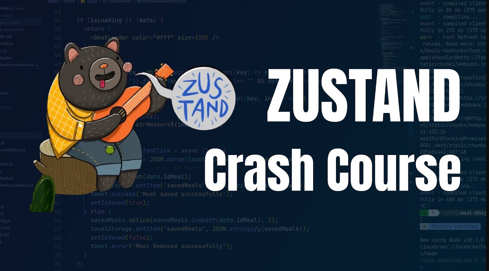

# Zustand Crash Course | React State Management

https://www.youtube.com/watch?v=QztUD2g85jo&ab_channel=WEBCIFAR

Today we are going to learn Zustand. A small, fast, and scalable bearbones state management solution. This is Redux alternative.  
WEB CIFAR

 

**Project** --> TodoList with global state managment zustand 
**Channel** --> WEB CIFAR 56,1 mil inscritos 
**Date Created** --> 19 de jun. de 2023

### npm Commands

created with vite
npm i zustand

### Components

-  main
-  App
-  AddTodoForm
-  TodoItem
-  Actions(load,remove)
-  TodoStore

### Libraries

-  vite
-  react
-  zustand
-  typescript
-  tailwind

### Observations/Notes

-  todo field input with a button on homepage
-  listing of todos on homepage as well
-  two button on home page
   -  one to load random todos from an API
      const res = await fetch("https://jsonplaceholder.typicode.com/todos")
   -  the other to clean the state of todos in the app
-  every todo has a checkbox that when clicked and a cross line on the text of a todo
-  every todo also has a delete icon trash can on the end of the line
-  devtools from redux used with zustand
-  persist stuff on global store managment

### Timestamps  

00:00 - Intro 
00:42 - Initial Stats & Actions 
16:28 - Redux DevTools With Zustand 
20:00 - Persist Store in Local Storage 
22:46 - Async Actions
